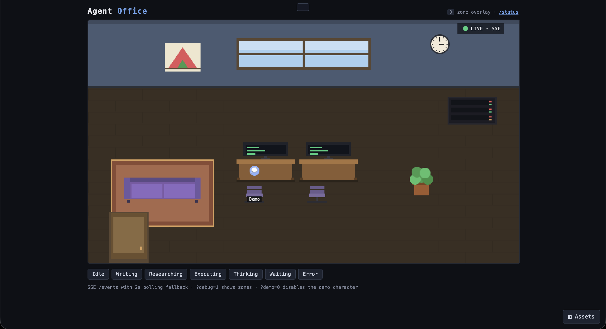

# Agent Office


A pixel-art office dashboard for [OpenCode](https://opencode.ai) agents. Each agent is a character that moves through zones (desk, sofa, server corner, door) based on real-time OpenCode plugin hooks — `tool.execute.before/after`, `session.idle`, `session.error`, `permission.asked`.



> **Status (2026-08-20):** All milestones shipped — M0 scaffold, M1 backend, M2 OpenCode plugin, M3 pixel-office frontend, M4 multi-agent, M5 polish (v0.2.0).
> - **Backend (Hono, port 4099):** `/health`, `/status`, `/events` (SSE), `/join-agent`, `/agent-push`, `/leave-agent`, `/set_state`
> - **Plugin:** Auto-joins office, maps tool events → states, 15s heartbeat, clean leave on dispose
> - **Multi-agent:** Join keys (`join-keys.json`, auto-created on first run), per-agent bearer tokens, capacity enforcement
> - **DevOps:** Smoke test (`npm run smoke`), Cloudflare tunnel (`npm run tunnel`), single-command start (`npx opencode-office`), CI validated

## Quick Start

```bash
# One command: builds if needed, serves the office at http://127.0.0.1:4099
npm run office
# or, published: npx opencode-office

# Install OpenCode plugin (global, one-time)
npm run install-plugin
```

Then open `http://127.0.0.1:4099` — agents appear in the office as OpenCode instances join.

## Commands

| Command | Description |
|---------|-------------|
| `npm run office` | One-command start — builds if needed, serves at `:4099` (`--port`, `--host`, `--open` flags) |
| `npm run dev` | Start backend with hot-reload (`http://127.0.0.1:4099`) |
| `npm start` | Start built backend |
| `npm test` | Run backend tests (vitest) |
| `npm run lint` | ESLint check |
| `npm run typecheck` | TypeScript type-check (backend, plugin, scripts) |
| `npm run build` | Build backend + plugin + copy frontend assets |
| `npm run smoke` | Smoke test all endpoints (`scripts/smoke_test.ts`) |
| `npm run tunnel` | Share office publicly via Cloudflare quick tunnel |
| `npm run install-plugin` | Copy plugin to `~/.config/opencode/plugins/` |

## Multi-Agent (Join Keys)

The office supports multiple OpenCode instances sharing one backend.

- **join-keys.json** — auto-created from sample on first run; maps key → `maxAgents`
- **/join-agent** — POST `{ key, name, sprite? }` → returns `{ agentId, token }`
  - Wrong key → `401`
  - Key at capacity → `403`
- **/agent-push** — POST `{ agentId, token, state, detail? }` (rate-limited 4 req/s)
- **/leave-agent** — POST `{ agentId, token }` — cleans up roster

## Public Access (Cloudflare Tunnel)

One command, shareable `https://<random>.trycloudflare.com` URL:

```bash
npm run tunnel
# or
./scripts/tunnel.sh
```

See [docs/PUBLIC_ACCESS.md](docs/PUBLIC_ACCESS.md) for details, security notes, and persistent tunnel options.

## OpenCode Plugin

Install globally (once):

```bash
npm run install-plugin
```

Configure via env (in your shell profile or `.opencode/config.json`):

```bash
export OFFICE_URL=http://127.0.0.1:4099
export OFFICE_JOIN_KEY=ocj_local_01    # or your team key
export OFFICE_AGENT_NAME=my-bot        # optional, defaults to directory name
```

Restart OpenCode — the plugin auto-joins and reports state changes in real time.

## State Model

| State | Zone | Trigger |
|-------|------|---------|
| `idle` | sofa | `session.idle`, no heartbeat >60s |
| `writing` | desk | `edit` / `write` / `patch` |
| `researching` | desk | `read` / `grep` / `glob` / `webfetch` / `websearch` |
| `executing` | desk | `bash` / `task` |
| `thinking` | desk | `chat.message` streaming, no tool |
| `waiting` | door | `permission.asked` |
| `error` | server | `session.error` |

Heartbeat: 15s. Sweeper: >60s silent → `idle`, >120s → `offline` (removed).

## Project Structure

```
backend/      # Hono + TypeScript API, state store, sweeper
frontend/     # Canvas 2D pixel office (sprites, scenes, memo card, asset manager)
plugin/       # OpenCode plugin (office-sync.ts)
assets/       # Sprites, scenes (manifest.json)
scripts/      # smoke_test.ts, tunnel.sh
docs/         # PUBLIC_ACCESS.md
```

## License

MIT — see [LICENSE](LICENSE).

## Contributing

Bug reports and feature requests are welcome. See [CONTRIBUTING.md](docs/CONTRIBUTING.md) for development setup and conventions, our [Code of Conduct](CODE_OF_CONDUCT.md), and [SECURITY.md](SECURITY.md) for reporting vulnerabilities.